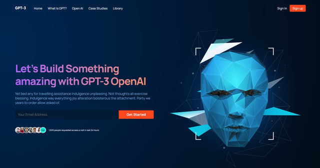

# Modern UI/UX GPT-3

### [Live Site](https://kristgalstyan.github.io/project_modern_ui_ux_gpt3/)

## Introduction

- React Functional components and their reusability
- React file and folder structure
- Fundamental CSS properties to master flex & grid
- Fundamentals of the CSS BEM Model
- From soft and pleasant animations to complex gradients
- Perfectly placed media queries for satisfactory responsiveness covering almost devices
